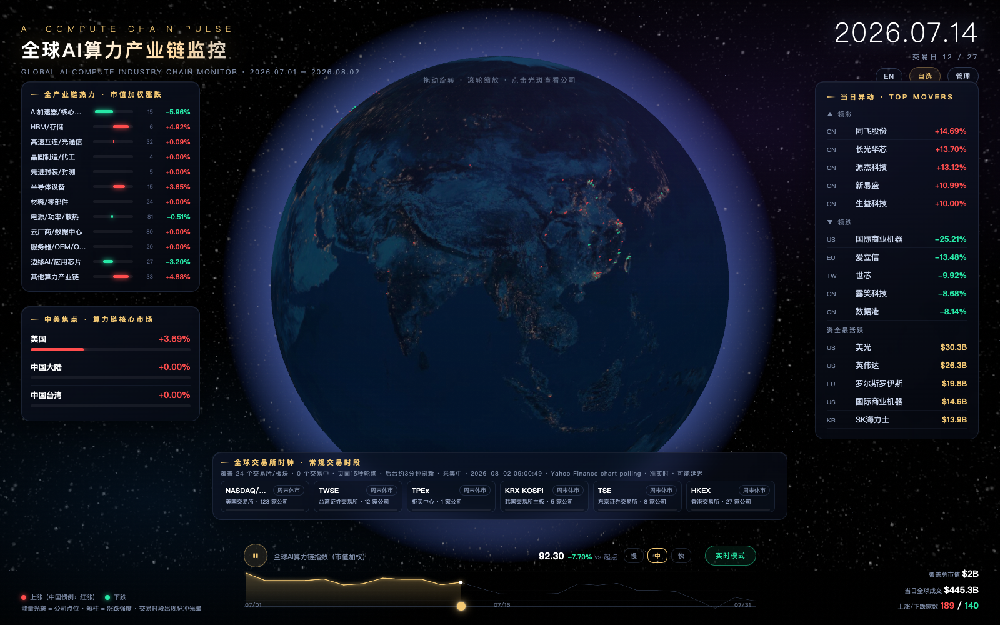
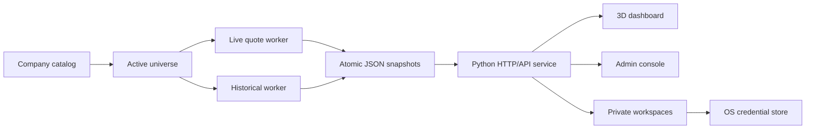

# AI Compute Chain Pulse

[](https://github.com/jackimac03211987/ai-compute-chain-monitor/actions/workflows/tests.yml)
[](LICENSE)

An interactive 3D market-monitoring terminal for the global AI compute supply chain. It combines a WebGL globe, near-real-time quote polling, historical market windows, a managed company catalog, private user workspaces, and configurable endpoint monitoring in one self-hosted Python application.

The project is designed for research, visualization, and small private deployments. It does not require a JavaScript build system: the frontend is served directly by the Python service and all browser dependencies are vendored locally.

## Demo



The main screen is a live operations view of the global AI compute supply chain:

- **Center:** an interactive WebGL globe places monitored companies in their operating regions and visualizes market direction.
- **Left:** industry-segment and focus-market panels summarize market-cap-weighted movement across the compute stack.
- **Right:** top gainers, top decliners, and the most active companies provide an immediate market pulse.
- **Bottom:** exchange sessions, collection status, the compute-chain index, turnover, and market breadth remain visible while the globe is explored.

The screenshot is an illustrative market snapshot; quotes may be delayed and availability depends on the configured upstream data source. To run the interactive demo locally, follow [Quick Start](#quick-start), then open `http://127.0.0.1:8911/` in a WebGL-capable browser.

## Highlights

- 3D globe with company locations, regional market state, exchange hours, and language-aware gain/loss colors.
- Near-real-time and historical quote pipelines with atomic JSON writes and single-process locks.
- Admin console for company catalogs, imports, exports, task runs, interface health, and audit events.
- Isolated user workspaces with Argon2id-hashed personal tokens, private watchlists, private interfaces, and scoped support grants.
- SSRF-hardened interface probes, bounded concurrency, per-tenant budgets, authentication backoff, and response-size limits.
- Local-first deployment with optional HTTPS reverse proxy or private overlay network.

## Architecture



The service uses the standard-library `ThreadingHTTPServer`. Persistent state is stored under `data/`; identity data uses SQLite and private workspace files are isolated by tenant and user identifiers.

## Requirements

- Python 3.10 or newer
- macOS or Linux for the core dashboard and quote workers
- macOS Keychain for storing private interface credentials with the bundled credential adapter
- A WebGL-capable desktop browser

## Quick Start

```bash
git clone https://github.com/jackimac03211987/ai-compute-chain-monitor.git
cd ai-compute-chain-monitor

python3 -m venv .venv
source .venv/bin/activate
python -m pip install --upgrade pip
python -m pip install -r requirements-runtime.lock

export AICM_BIND_HOST=127.0.0.1
export AICM_PORT=8911

# Build initial market snapshots. The historical run can take several minutes.
python fetch_live.py
python fetch_data.py

python app.py
```

Open `http://127.0.0.1:8911/`.

On first start, the server creates `data/admin_token.txt` with owner-only file permissions. Use that token only in the admin console or authenticated API calls. Never commit or share it.

The built-in catalog is used when `data/watchlist.json` does not exist. To add or correct company metadata without changing Python source:

```bash
cp data/company_overrides.example.json data/company_overrides.json
```

`data/company_overrides.json` is intentionally ignored by Git.

## Main Routes

| Route | Purpose |
|---|---|
| `/` | 3D market dashboard |
| `/admin/` | Operations and catalog console |
| `/private/` | Token-gated personal workspace |
| `/api/health` | Service and data health summary |
| `/api/watchlist` | Active company catalog |

Write operations require an admin or personal token. Raw personal tokens are shown once and only Argon2id hashes are stored by the server.

## Configuration

The application reads environment variables directly. `.env.example` is a reference file and is not loaded automatically.

| Variable | Default | Description |
|---|---:|---|
| `AICM_BIND_HOST` | `127.0.0.1` | Main HTTP bind address |
| `AICM_PORT` | `8911` | Main HTTP port |
| `AICM_LOOPBACK_PORT` | `0` | Optional second loopback listener for a reverse proxy |
| `AICM_REQUIRE_TOKEN` | `1` | Require authentication for write operations |
| `AICM_ADMIN_TOKEN` | generated | Optional initial admin token; prefer generated local storage |
| `AICM_MAX_CONCURRENCY` | `24` | Shared HTTP concurrency limit |
| `AICM_CONNECTION_TIMEOUT` | `30` | Per-connection timeout in seconds |
| `AICM_LIVE_SOURCE` | `chart` | Live quote transport: `chart`, `yfinance`, or `auto` |
| `AICM_REFRESH_SECONDS` | `180` | Recommended live refresh interval |
| `AICM_MONITOR_MAX_PENDING` | `16` | Pending custom-interface work limit |
| `AICM_TENANT_HOURLY_PROBES` | `120` | Per-tenant outbound probe budget |

For remote access, keep the service bound to loopback and place it behind a TLS reverse proxy or a private overlay. Do not expose the raw HTTP service or the admin token directly to the public internet.

## Scheduled Refresh

Run the live worker at a conservative interval such as three minutes and the historical worker once per trading day. Use your platform scheduler of choice and ensure only one instance of each worker runs at a time; both workers include process locks, but the scheduler should still avoid unnecessary overlap.

Example manual runs:

```bash
source .venv/bin/activate
python fetch_live.py
python fetch_data.py
python health_check.py --base http://127.0.0.1:8911
```

## Security Model

- Admin and personal tokens are tab-scoped in the web UI.
- Authentication failures use a bounded failure window and progressive backoff.
- Private user roots are derived from server-side tenant and user identities.
- Custom interface probes reject loopback, private, link-local, metadata, multicast, and overlay-network destinations by default.
- Redirects are revalidated, response bodies are capped, credentials are not returned by APIs, and audit payloads are recursively redacted.
- The default bind address is loopback. Remote deployment requires an explicit configuration change.

See [SECURITY.md](SECURITY.md) for vulnerability reporting and deployment boundaries.

## Data and Market-Data Notice

The bundled workers use public Yahoo Finance chart endpoints and may optionally use `yfinance`. These sources are unofficial, can be delayed or unavailable, and provide no service-level guarantee. You are responsible for complying with every upstream provider's terms, exchange rules, and redistribution restrictions.

This repository contains software and public seed metadata, not a licensed market-data feed. Do not use it to redistribute market data or operate a commercial service without an appropriately licensed source. Nothing produced by this project is investment advice.

## Tests

```bash
python -m unittest discover -s tests -v
```

The suite covers authentication, tenant isolation, imports/exports, interface policy, scheduler backpressure, HTTP concurrency, backup/restore logic, and frontend security contracts.

## Contributing

Read [CONTRIBUTING.md](CONTRIBUTING.md) before submitting changes. Never include tokens, user databases, private company lists, generated quotes, internal network addresses, or provider credentials in an issue or pull request.

## Third-Party Software

The frontend redistributes Three.js, Globe.GL, Lucide, and texture assets from the Three-Globe examples. Their notices are listed in [THIRD_PARTY_NOTICES.md](THIRD_PARTY_NOTICES.md).

## License

This project is licensed under the [Apache License 2.0](LICENSE). Third-party components remain under their respective licenses.
